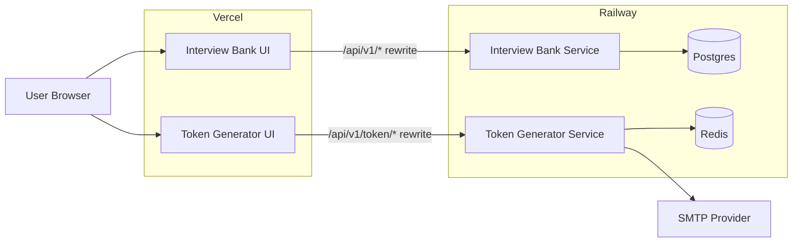
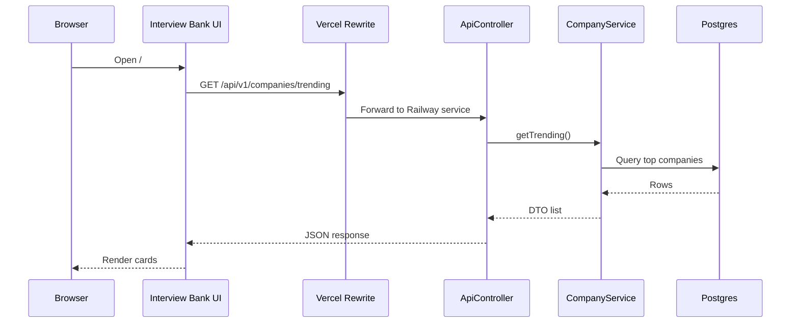
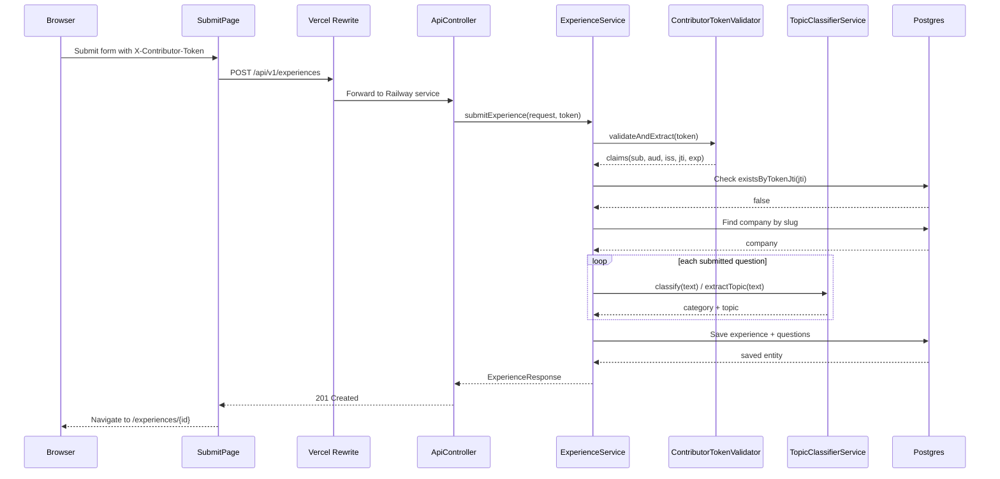

# Interview Bank Architecture

This document explains how the full platform works in production and how the main request flows move through the code.

## Big Picture

`interview-bank` is the main product users browse and submit to.

- The `ui/` folder is a Vite React app deployed to Vercel.
- The `service/` folder is a Spring Boot API deployed to Railway.
- The API stores company and interview data in Postgres.
- Submission uses a contributor token issued by the separate `token-generator` repo.

One important architectural detail:

`interview-bank` does not call the token-generator backend when a user submits an experience. It validates the JWT locally using the shared `JWT_SECRET`, expected issuer, expected audience, and one-time `jti`.

## Runtime Architecture

## Repo Responsibilities

| Repo | Main job | Persistent store |
| --- | --- | --- |
| `interview-bank` | Browse companies, read experiences, predict question categories, accept verified submissions | Postgres |
| `token-generator` | Validate email domains, send OTPs, verify OTPs, issue signed JWTs | Redis for OTP state |

## Main Code Map

### UI

- `ui/src/App.tsx`: route shell
- `ui/src/pages/HomePage.tsx`: homepage company browsing
- `ui/src/pages/CompanyPage.tsx`: company details, experiences, prediction panel
- `ui/src/pages/SubmitPage.tsx`: token paste + submission wizard
- `ui/src/services/api.ts`: Axios client and UI-to-API calls
- `ui/vercel.json`: Vercel rewrite to Railway API

### Service

- `service/src/main/java/com/interviewbank/controller/ApiController.java`: REST entry points
- `service/src/main/java/com/interviewbank/service/CompanyService.java`: company list/detail logic
- `service/src/main/java/com/interviewbank/service/ExperienceService.java`: read/write experience flow
- `service/src/main/java/com/interviewbank/service/PredictionService.java`: probability estimation
- `service/src/main/java/com/interviewbank/service/TopicClassifierService.java`: keyword-based tagging
- `service/src/main/java/com/interviewbank/security/ContributorTokenValidator.java`: local JWT verification
- `service/src/main/resources/application.yml`: ports, profiles, JWT, DB, CORS

## Request Flow: Browse Companies

When a user opens the homepage:

1. The browser loads the Vercel-hosted React app.
2. `ui/src/pages/HomePage.tsx` uses React Query to call `getTrendingCompanies()` or `getCompanies()`.
3. `ui/src/services/api.ts` sends the request to `/api/v1/...`.
4. Vercel rewrites `/api/v1/*` to the Railway `interview-bank` service.
5. `ApiController` receives the request.
6. `CompanyService` reads from `CompanyRepository` and `ExperienceRepository`.
7. Postgres returns the data.
8. Spring maps entities to DTOs and returns JSON.
9. React Query caches the response and renders the company cards.

### Sequence: Homepage Read Path

## Request Flow: Company Page And Prediction

When a user opens `/companies/:slug`:

1. `CompanyPage.tsx` requests:
   - `GET /api/v1/companies/{slug}`
   - `GET /api/v1/companies/{slug}/experiences`
2. `PredictionPanel` separately requests:
   - `GET /api/v1/companies/{slug}/predict?role=...`
3. `PredictionService` pulls historic question counts from Postgres.
4. It applies Laplace smoothing and returns ranked category probabilities plus top topics.

Prediction is local to `interview-bank`; no external ML service is called.

## Request Flow: Contributor Token Generation

This starts in the other repo, but it matters because `interview-bank` depends on the output.

1. The user clicks the token-generator link from `SubmitPage.tsx`.
2. The token-generator UI loads `?app=interview-bank`.
3. It fetches client metadata from `GET /api/v1/token/client/interview-bank`.
4. The user types an email.
5. The UI performs instant client-side blocking for personal/disposable domains.
6. On blur or submit, the UI calls `POST /api/v1/token/validate-email`.
7. The token-generator service runs `EmailValidationService`:
   - personal provider block
   - disposable provider block
   - MX lookup
8. When the user requests an OTP, `OtpService` stores the OTP and attempt counter in Redis.
9. `EmailService` sends the OTP email via SMTP.
10. When the user verifies the OTP, `TokenIssuerService` creates a signed JWT with:
   - `sub = email`
   - `iss = interview-bank-token-generator`
   - `aud = interview-bank`
   - `jti = UUID`

## Request Flow: Submit Experience

This is the most important end-to-end flow.

### Sequence: Submit Experience With Contributor Token

### What Happens Inside `ExperienceService`

`service/src/main/java/com/interviewbank/service/ExperienceService.java`

1. Validate the JWT locally with `ContributorTokenValidator`.
2. Extract the submitter email and token `jti`.
3. Reject the request if that `jti` already exists in Postgres.
4. Resolve the target company by slug.
5. Build the `InterviewExperience` entity.
6. For each question:
   - use the provided category if one exists
   - otherwise run `TopicClassifierService.classify(...)`
   - infer a topic with `extractTopic(...)`
7. Save the experience and questions in one transaction.
8. Return the created experience DTO.

## Why Submission Does Not Need A Live Token-Generator Call

At submit time, `interview-bank` only needs the token string.

It checks the token locally using:

- the shared `JWT_SECRET`
- expected issuer
- expected audience
- expiration
- one-time `jti` reuse protection

That is why `token-generator` can be thought of as an issuing service, while `interview-bank` is the consuming and enforcing service.

## End-To-End User Walkthrough

### Read-only browsing

1. User opens the Interview Bank site.
2. Home page fetches trending or searched companies.
3. User clicks a company.
4. Company page fetches:
   - company detail
   - approved experiences
   - prediction data
5. User reads public interview experiences.

### Verified submission

1. User opens `/submit`.
2. UI asks for a contributor token.
3. User opens token-generator in a new tab with `?app=interview-bank`.
4. Token-generator loads the `interview-bank` client config.
5. User enters a company email.
6. Token-generator validates the domain.
7. User requests OTP.
8. Token-generator stores OTP in Redis and sends it through SMTP.
9. User enters the OTP.
10. Token-generator verifies the OTP and returns a JWT.
11. User pastes the JWT into Interview Bank.
12. User fills in company, role, round details, and questions.
13. Interview Bank verifies the JWT locally and checks one-time use.
14. Experience and questions are saved in Postgres.
15. User is redirected to the newly created experience page.

## Operational Notes

- `GET` endpoints are public.
- `POST /api/v1/experiences` is allowed through Spring Security, but the real contributor check happens inside `ExperienceService`.
- Trending companies and prediction responses are cached.
- Production routing is:
  - Vercel for `ui/`
  - Railway for `service/`
  - Postgres for persistence

